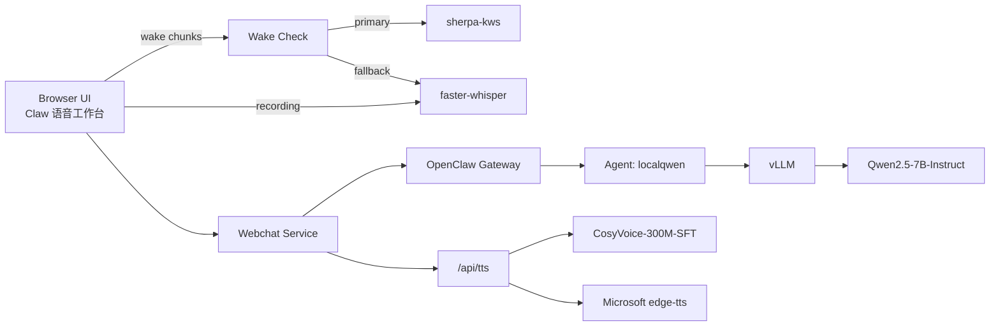

# Claw Voice Agent

本项目是一个可本地部署、可局域网访问的语音 Agent 工作台，目标是把以下能力收成一个可用系统：

- 唤醒词进入对话
- 浏览器录音 / 音频上传
- 服务器端 ASR 转写
- 本地 LLM 推理
- 文本回复转语音
- 局域网网页访问

当前主部署机是 `pro600`。

## 当前能力

- 文本对话：可用
- 浏览器录音上传：可用
- 服务器端 ASR：可用
- 本地 LLM：可用
- 回复 TTS：可用
- 局域网页面：可用
- 唤醒词：
  - 中文固定词 `你好`：当前主路径走本地 ASR 唤醒
  - `sherpa-kws` 已接入，但中文主路径仍在调优

## 当前技术栈

- Agent runtime: `OpenClaw`
- LLM serving: `vLLM`
- LLM model: `Qwen2.5-7B-Instruct`
- ASR: `faster-whisper large-v3`
- Local TTS: `CosyVoice-300M-SFT`
- API TTS fallback: `Microsoft edge-tts`
- Wake word:
  - 当前线上稳定路径：本地 ASR phrase match
  - 专用 KWS 在研：`sherpa-onnx`
- Web entry:
  - HTTP `18889`
  - HTTPS `18443`

## 系统架构



## 核心流程

### 1. 待机唤醒

1. 浏览器进入待机态。
2. 浏览器持续采样短音频片段。
3. 服务端先用 `sherpa-kws` 判断唤醒词。
4. 如果没命中，则退回本地 ASR 检查固定短语。
5. 命中后进入一轮正式对话。

### 2. 正式对话

1. 浏览器开始正式录音。
2. 音频上传到服务器。
3. `faster-whisper` 转写成文本。
4. 文本发送给 `OpenClaw -> localqwen -> vLLM -> Qwen2.5-7B-Instruct`。
5. 返回文本回复。
6. `/api/tts` 根据模式切到：
   - `CosyVoice 本地`
   - `Microsoft API`
7. 浏览器播放回复语音。

## 当前线上约束

- 中文唤醒词的最稳定路径目前还是本地 ASR，不是专用 KWS。
- `sherpa-kws` 已在线，但中文固定词还没调到可替代 ASR 的程度。
- 局域网录音请优先走 HTTPS 页面，否则浏览器可能拒绝麦克风。
- HTTPS 当前用自签证书，首次访问需要信任证书。

## 目录建议

建议把仓库整理成下面的结构：

```text
.
├── README.md
├── docs/
│   ├── architecture.md
│   ├── module-ownership.md
│   └── project-management.md
├── frontend/
├── services/
│   ├── webchat/
│   ├── wake/
│   ├── asr/
│   └── tts/
└── scripts/
```

当前工作区里已有的重要文档：

- [CLAW_AGENT_ARCHITECTURE.md](/Volumes/zzs2T/Agent/harness/CLAW_AGENT_ARCHITECTURE.md)
- [TASK_EXECUTION_GUARDRAILS.md](/Volumes/zzs2T/Agent/harness/TASK_EXECUTION_GUARDRAILS.md)

## 推荐协作方式

- 前端组只负责 UI、交互和状态可视化。
- 语音组拆成两条：
  - ASR / wake-word
  - TTS
- Agent 组负责 OpenClaw、LLM、prompt、tool routing。
- 平台组负责部署、局域网访问、systemd、证书、日志与回滚。

详细分工见：

- [MODULE_OWNERSHIP.md](/Volumes/zzs2T/Agent/harness/MODULE_OWNERSHIP.md)
- [PROJECT_MANAGEMENT.md](/Volumes/zzs2T/Agent/harness/PROJECT_MANAGEMENT.md)

## GitHub 落库建议

当前工作区还不是 git 仓库。建议先做：

1. 初始化仓库并确定根目录。
2. 把文档先提交为 `docs baseline`。
3. 再按模块拆分代码目录。
4. 最后给组员按模块分支协作。

建议初始分支：

- `main`
- `feat/frontend-workbench`
- `feat/wakeword`
- `feat/asr`
- `feat/tts`
- `feat/infra`

## 当前优先级

P0:
- 中文固定唤醒词真正稳定
- 网页待机态和对话态完全分层

P1:
- 多 agent 编排
- 前端产品化和视觉统一

P2:
- 中文专用 KWS 替代当前 ASR 唤醒主路径
- 证书与内网访问体验优化
