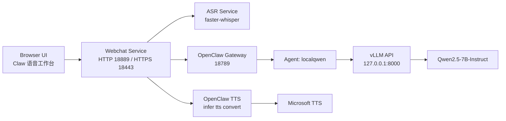

# 当前 Agent 架构文档

## 1. 目标

当前系统的目标是提供一个可本地部署、可局域网访问的语音 Agent 工作台，支持：

- 文本对话
- 浏览器录音 / 音频文件上传
- 服务器端 ASR 转写
- LLM 推理
- 回复 TTS 合成与播放

当前实际运行主机是 `pro600`，局域网地址为 `192.168.12.50`。

## 2. 总体架构



## 3. 当前运行组件

### 3.1 OpenClaw Gateway

- 角色：统一 Agent 运行时 / 控制平面
- 服务：`openclaw-gateway.service`
- 地址：`0.0.0.0:18789`
- 鉴权：`gateway.auth.token`
- 当前配置模式：`local + lan bind`

### 3.2 LLM Serving

- 服务：`vllm-qwen.service`
- Serving 框架：`vLLM`
- 当前模型：`Qwen2.5-7B-Instruct`
- served model name：`qwen-local`
- OpenClaw provider id：`vllm/qwen-local`
- 监听：`127.0.0.1:8000`

当前 vLLM 启动参数要点：

- `--gpu-memory-utilization 0.60`
- `--max-model-len 32768`
- `--enable-auto-tool-choice`
- `--tool-call-parser hermes`
- `--enforce-eager`

### 3.3 Agent

- 当前网页入口默认使用的 agent：`localqwen`
- workspace：`/home/aa-3090/.openclaw/workspace-localqwen`
- model：`vllm/qwen-local`

说明：

- 当前网页工作台是单 agent 路径，不是多 agent 编排器。
- `qa-channel` 仍保留在配置里，主要是测试用 synthetic channel，不是生产入口。

### 3.4 ASR

- 服务：`fw-whisper.service`
- 实现：`faster-whisper`
- 当前模型：`large-v3`
- device：`cuda`
- compute type：`float16`
- 服务监听：`127.0.0.1:9460`

当前 ASR 的角色是：

- 接收 webchat 上传的原始音频文件
- 在服务器侧做转写
- 返回文本给 webchat

### 3.5 TTS

- 触发方式：webchat 调用 `openclaw infer tts convert`
- 当前实际 provider：`microsoft`
- 当前常用中文 voice：
  - `zh-CN-XiaoxiaoNeural`
  - `zh-CN-XiaoyiNeural`
  - `zh-CN-YunyangNeural`

说明：

- TTS 不是通过 `messages.tts.auto` 全局自动发送，而是 webchat 服务在收到 LLM 文本回复后主动调用 one-shot TTS。
- 当前回复语音会保存为服务器文件，并在网页里直接播放。

### 3.6 Web 入口

#### HTTP

- 服务：`openclaw-webchat.service`
- 监听：`0.0.0.0:18889`
- 用途：
  - 本机开发
  - 本机通过 `127.0.0.1` 访问

#### HTTPS

- 服务：`openclaw-webchat-https.service`
- 监听：`0.0.0.0:18443`
- 用途：
  - 局域网其他设备访问
  - 远程浏览器麦克风权限需要安全上下文时使用

认证策略：

- webchat 层直接复用 `OpenClaw gateway token`
- 其他设备访问时，在页面顶部输入 token 完成连接

## 4. 端到端流程

### 4.1 文本对话

```text
Browser UI
  -> /api/chat
  -> webchat service
  -> openclaw agent --agent localqwen
  -> OpenClaw gateway
  -> vLLM / Qwen2.5-7B-Instruct
  -> reply text
  -> webchat UI
```

### 4.2 浏览器录音

```text
Browser MediaRecorder
  -> 生成原始 webm/opus 录音
  -> /api/transcribe 上传到服务器
  -> webchat 保存原始副本
  -> faster-whisper large-v3 转写
  -> 文本回填到输入框
  -> 用户确认后点击发送
  -> /api/chat
  -> localqwen
```

### 4.3 音频文件上传

```text
Browser file input
  -> /api/transcribe
  -> webchat 保存原始副本
  -> faster-whisper 转写
  -> 文本回填
  -> 用户确认后发送
```

### 4.4 回复语音

```text
LLM reply text
  -> /api/tts
  -> openclaw infer tts convert
  -> Microsoft TTS
  -> 生成 mp3
  -> webchat 保存回复语音副本
  -> Browser 自动播放/手动播放
```

## 5. 当前网页工作台的状态机

当前 UI 以单机器人工作台为核心，主要状态包括：

- 待命
- 正在聆听
- 上传中
- 转写中
- 思考中
- 准备开口
- 可以播放
- 出错了

同时保留三类证据面板：

- 浏览器本地录音
- 服务器收到的原始音频副本
- 回复语音

这样可以区分问题到底发生在：

- 浏览器采集
- 上传链路
- ASR 转写
- LLM 回复
- TTS 合成

## 6. 认证与访问方式

### 本机

- URL：`http://127.0.0.1:18889/chat?session=main`

### 局域网其他设备

- URL：`https://192.168.12.50:18443/chat?session=main`
- 输入 `gateway token` 后接入

注意：

- 其他设备录音必须优先走 HTTPS 入口，否则浏览器可能拒绝麦克风权限。
- 当前 HTTPS 使用自签证书，首次访问时浏览器需要先信任/继续访问。

## 7. 当前实际使用的模型与组件总结

- LLM：`Qwen2.5-7B-Instruct`
- LLM serving：`vLLM`
- ASR：`faster-whisper large-v3`
- TTS：`Microsoft TTS`
- Agent runtime：`OpenClaw`
- Web UI：自定义 `webchat server.py`

## 8. 当前限制

### 8.1 多 Agent

- 当前网页入口默认只走 `localqwen`
- 多 agent 并行编排尚未接入网页层

### 8.2 UI

- 当前 UI 已经有工作台和状态机，但仍然偏工程工具风格
- 还可以继续做产品化与视觉统一

### 8.3 证书

- 局域网 HTTPS 依赖自签证书
- 其他设备首次使用需要处理证书信任

### 8.4 TTS 配置

- 当前 TTS 是网页层主动调用的 one-shot TTS
- 不是 OpenClaw 全局自动消息播报配置

## 9. 后续建议

优先级建议如下：

1. 把网页层接入多 agent selector / orchestrator
2. 做更成熟的产品级 UI
3. 将 HTTPS 证书替换成更容易信任的局域网证书方案
4. 如果中文转写仍有问题，再对比 `SenseVoice` 等中文优先 ASR
